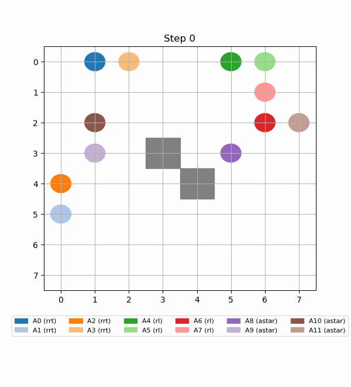

# Hybrid CBS Project with RRT*, RL, and A*

This repository contains an implementation of a hybrid CBS (Conflict-Based Search) planner that integrates three different low-level planners:  
**RRT\***, **Reinforcement Learning (RL)**, and **A\***.  
The project demonstrates flexible multi-agent path planning capabilities, leveraging the strengths of different methods for more robust performance.

## 🎥 Example Animation

Here’s a quick example of the path planning animation(16 agents, 25% occupancy rate):

---

## 📂 Files

- **`RL_train.py`**  
  Train the RL planner (Rainbow DQN) for single-agent scenarios.

- **`CBS.py`**  
  Test the CBS framework in multi-agent scenarios with flexible low-level planners (RRT\*, RL, and A\*).

- **`best_47.42.pth`**  
  Pre-trained model weights for the RL planner.

- **`README.md`**  
  This file, containing an overview of the project and usage instructions.

---

## ▶️ How to Run

### 1️⃣ Train the RL Planner

To train the RL planner, run the following command in your terminal:
`` python RL_train.py
`` 

### 2️⃣ Test CBS with RRT*, RL, and A* for Multi-Agent Planning

To test the CBS framework with your choice of RRT*, RL, or A*, run:
`` python CBS.py
`` 

You can configure which low-level planner to use within the `CBS.py` script by modifying the corresponding parameters.

---

## 💡 Notes

- Make sure to have the required Python dependencies installed (e.g., \`torch\`, \`numpy\`, \`matplotlib\`, etc.).
- The \`best_47.42.pth\` file contains the trained RL model for immediate testing.
- Feel free to modify the scripts for your own experiments or to extend the project further!
